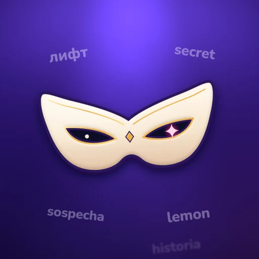
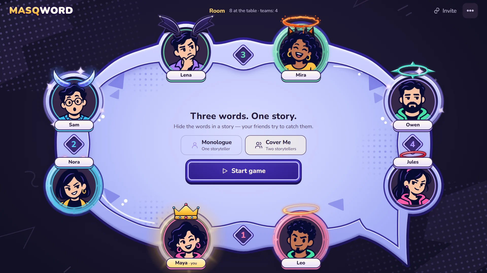
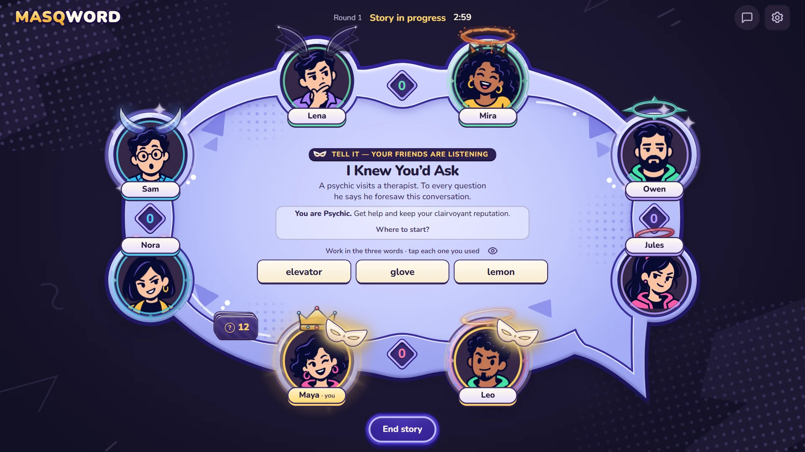
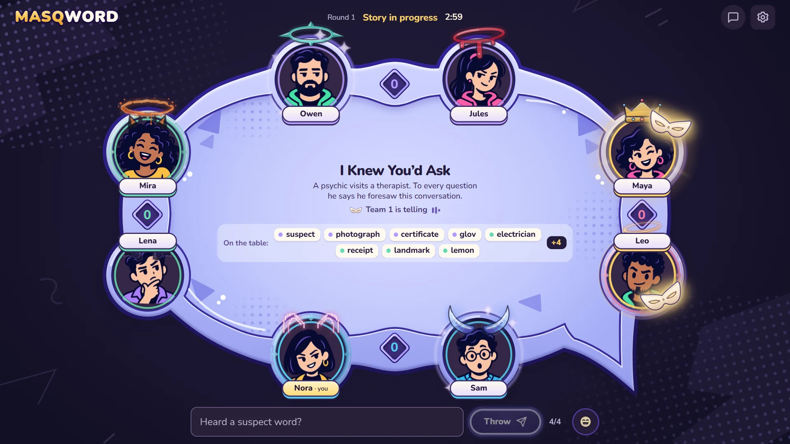
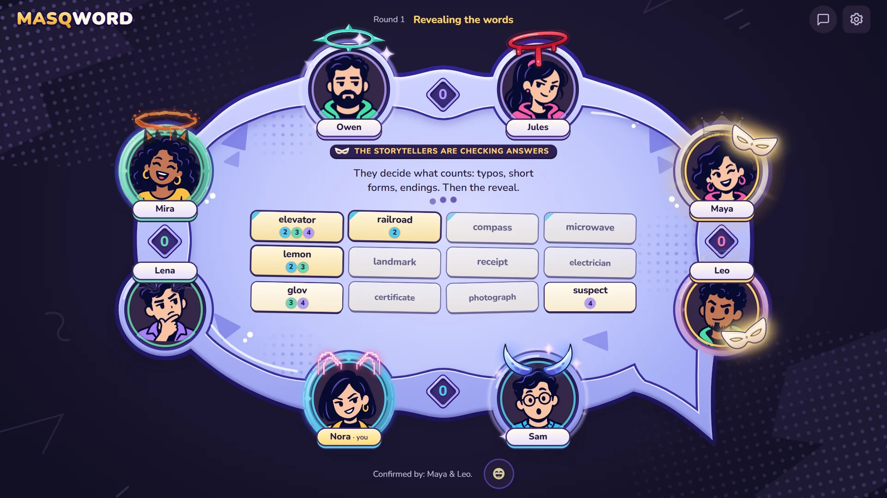
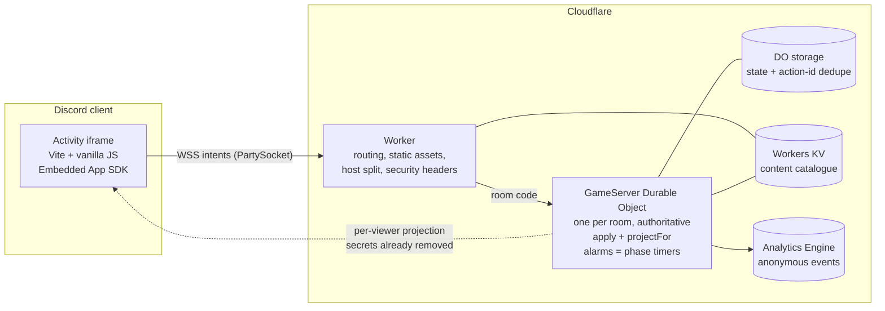
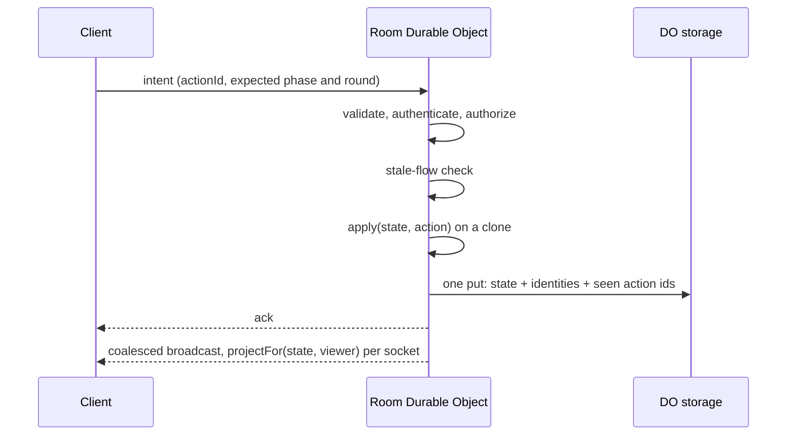

  

<h1 align="center">MASQWORD — showcase</h1>

<b>Hide three words in a story. Your friends try to catch them.</b> 
A party game that runs inside Discord voice channels, built by a small team working with Claude Code.

<a href="https://masqword.com">masqword.com</a> · <a href="https://masqword.com/games">Games</a> · <a href="https://masqword.com/press">Press kit</a>

This is a **public showcase**, not the game's source. The game repository is private. This repo shows the real tech stack, how the architecture protects hidden information, how a small team builds with AI, and short, non-sensitive code excerpts that illustrate the approach.

## The studio

MASQWORD is an independent game studio: **a Ukrainian team based in Austria**, founded in summer 2026 by Rostyslav Ostapenko, team of five. We build social multiplayer games for Discord and the web.

| Game | Status |
| --- | --- |
| **MASQWORD** | Playable as a Discord Activity. Pre-launch: finished feature set, playtested with friends, public launch and community-server rollout are next. We have no public player numbers to claim. |
| **Bunker** (working title) | In development. A social debate game: players argue over who earns a place in the bunker. For Discord, mobile and the web. |
| *Untitled word game* | Coming soon. A word party game designed for Discord voice chat; our biggest game yet. |

## The game

One player gets a situation and **three secret words** and tells a story out loud, working the words in naturally. Everyone else listens (voice stays in Discord or with the people in the room), throws the words they suspect onto a shared table, then votes. The reveal shows who caught which word and who smuggled one past everybody. 2–8 players, solo or in teams, in **English, Spanish and Russian**.

| | |
| --- | --- |
|  |  |
| *Lobby: up to eight seats, solo or teams* | *Storyteller: the scene and three secret words* |
|  |  |
| *Listener: sees the table, never the secret words* | *Reveal: storytellers judge typos and short forms, then the table is revealed* |

Screenshots come from a dev fixture with fictional players (see [`examples/screenshot-pipeline.py`](examples/screenshot-pipeline.py)).

## Tech stack

| Layer | Choice |
| --- | --- |
| Client | **Vite** and **vanilla JavaScript + CSS**, no UI framework. A DOM party controller, not a canvas game. Self-hosted WOFF2 fonts, WebP sprites, an `FxGovernor` that lowers effects for reduced-motion, weak devices, long frames and Discord layout and thermal signals. |
| Discord | **Discord Embedded App SDK**: the client runs as an Activity inside the voice channel (lifecycle, invite dialog, Rich Presence). |
| Realtime backend | **Cloudflare Workers** and **Durable Objects** via **partyserver**: one SQLite-backed Durable Object per room, hibernation, alarms as authoritative phase timers. **PartySocket** on the client. |
| Rules | A **pure reducer** `apply(state, action, ctx)` shared by the browser mock and the server, plus a **per-viewer projection** `projectFor(state, viewerId)` so secrets never reach the wrong socket. |
| Persistence | Durable Object storage (room state and action-id dedupe), **Workers KV** (editable content catalogue), **Workers Analytics Engine** (anonymous gameplay statistics: no typed words, no names, no room codes). |
| Languages | Three UI languages (device or Discord locale) and a separate room language; scene and word packs per language, with a seeded chi-square test on the word draw. |
| Checks | **Vitest**: 756 tests in 71 files, all passing on 2026-10-08. An integration harness boots the Worker locally and drives independent authenticated clients through team, improv and shared-table flows. **Playwright** captures screenshots at fixed viewports. |
| Tooling | Node 22, Wrangler 4, Python (Pillow, Playwright) for brand art and the studio site. |

The private repository is organised as `src/state` (rules, content), `src/ui` (screens), `src/net` (sockets, reliability), `src/lib` (i18n, Discord, effects governor) and `worker/src` (room server, protocol allowlist, lifecycle, site routing, telemetry).

## Architecture

How one action is committed (from our backend spec):

Decisions worth knowing about:

- **The server is the only authority.** The client sends intent; UI checks are never treated as security.
- **Hidden information is removed, not hidden.** The projection leaves other teams' secret words, other players' drafts and private chat out of the payload entirely. See [`examples/reducer-and-projection.mjs`](examples/reducer-and-projection.mjs).
- **Strict protocol.** Every frame is rebuilt from an allowlist of types, fields, enums and bounds, and a delayed action from an earlier turn is dropped instead of applied to the next one. See [`examples/action-allowlist.mjs`](examples/action-allowlist.mjs).
- **Idempotent commits.** Recent action ids are stored in the same record as the state, so a retry after a lost ack is acknowledged without running the rules twice.
- **One Worker, two hostnames.** The studio site and the game share a Worker and are split by host. See [`examples/host-split-routing.mjs`](examples/host-split-routing.mjs).
- Abuse limits exist for connections, actions and room creation; their parameters are deliberately not published.

## Built with AI

Claude Code is our main engineering tool. Of the 112 commits in the private repository (first commit 2026-07-20, counted on 2026-10-08), **99 carry a Claude `Co-Authored-By` trailer**, from sessions on Claude Sonnet 5.5, Opus 5.5 and Fable 5.1. A Claude Code session acts as Lead: it owns intent, architecture, integration and acceptance, and works from a rules file and a short handoff note instead of chat history. Sub-agents take bounded packets (exact files, behaviour, checks) and read-only review passes. Humans decide the product, the look and anything involving publishing or money. The working agreement is in [`docs/ai-workflow.md`](docs/ai-workflow.md).

Concrete examples from the history (commit ids refer to the private repository):

- **Localisation into English and Spanish.** A Claude session wrote the full EN and ES UI dictionaries and the live language switching (`b444d5a`, `477e778`). A *different* coding agent worked read-only alongside it in two phases: first a glossary and a risk list (words with vulgar or double meanings in Spain or Latin America, false friends, literal calques), then a line-by-line review of both dictionaries against real released localisations of party games, one table row per problem with a proposed text and a source. The agreed terminology went into the dictionaries, for example one turn is one story and a round is a full circle, *lanzar* and never *tirar*. The result was checked on screenshots of the game's phases in both languages at three viewport sizes, plus a programmatic overflow report.
- **Security reviews that changed the code.** Multiplayer changes pass an independent review before they ship. Fixes that came out of review passes: in the "open table" mode (listeners read thrown words live, the storyteller stays blind) duplicate-word echoes were hidden from storytellers, undo was capped per story, echoes were capped and throws were blocked while paused (`4cc83ed`); a host action that changes the storyteller was restricted to the lobby and preparation (`b2cef8f`); a kicked listener stopped blocking the vote and invisible or bidirectional characters were stripped from nicknames (`f5e7f85`). The backend spec lists the regression tests a change of this kind must carry: forged actors, words and indices, stale versions, concurrent final contributions, durable replay after a lost ack, disconnect and host fallback.
- **Brand and store art rendered by scripts.** The icon, cover and background art, Rich Presence badges and social images are produced by Python scripts (SVG drawn as code, lit with SVG filters, rendered by Chromium through Playwright), and the store screenshots by a script that drives the real client (`48cdeec`). A colour or size change is one command, not a redraw. Art direction stays with a human art director; Claude Code writes and iterates the scripts.
- **The studio site is generated.** One script turns a config into static HTML with JSON-LD, `robots.txt` (Claude's crawlers explicitly allowed), `sitemap.xml` and `llms.txt`, and the Worker routing that serves it is unit-tested (`97f6e34`). Values the owner has not confirmed stay empty and are left out, never invented. See [`examples/studio-site-generator.py`](examples/studio-site-generator.py).
- **Screenshot-based design checks.** Layouts are captured with Playwright at fixed sizes (including short landscape phone frames, because Activities run in small windows), read back, measured and fixed. One UI pass records a 25-viewport sweep reporting 0/200 issues (`d9fdb3e`). An image-comparison model can give an advisory second opinion; it never replaces looking at the pixels or human acceptance.
- **Evidence in commit messages.** Commits carry the checks that were run, for example "unit 567/567, build ok, 25-viewport sweep 0/200 issues". The local mock, a local real-Worker run, a real Discord client, a physical phone and a human playtest are tracked separately, and a pass on one is never reported as a pass on another.

We are model-agnostic below the Lead. The history also shows Codex used for server-side waves, Devin SWE-2 for UI packets and Gemini Flash for small tests and copy, each reviewed by the Lead before merging. We measure what each tool is good at and reassign work accordingly.

**Planned, not built yet: Claude inside the product.** A game master that writes fresh scenes for each table in the room's language; fair judging of near-miss guesses (typo, short form, different word); moderation and translation of community content packs before they reach other tables; short post-game recaps. We would use a small fast model for judging and moderation and a larger one for scene writing.

## What is in this repository

| Path | Content | Licence |
| --- | --- | --- |
| [`examples/`](examples) | Five short code excerpts with explanatory headers | MIT |
| [`docs/ai-workflow.md`](docs/ai-workflow.md) | How we work with AI | All rights reserved |
| [`screenshots/`](screenshots) | Four game screenshots and the app icon (WebP) | All rights reserved |

## What is deliberately not here

The game's source code, scene and word content, operations tooling, sign-in and session handling, anti-abuse parameters, cosmetics artwork sources, deployment configuration and analytics configuration. They are either the product itself or would help someone attack it.

## Licence

Code in `examples/` is MIT. Screenshots, icon, name, artwork and written content are **all rights reserved**. Details in [LICENSE](LICENSE).

## Contact

[masqword.com](https://masqword.com) · [contact@masqword.com](mailto:contact@masqword.com)
